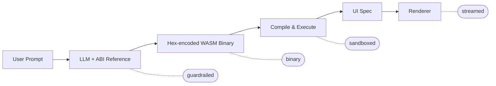

# wasm-render

**The framework for User-Generated Interfaces (UGI) via WebAssembly bytecode.**

LLMs generate raw WebAssembly binary directly — no intermediate code, no JSON patches. The WASM module executes against host-imported functions to build a UI spec that React, React Native, or Remotion renders.

```bash
npm install @json-render/core @json-render/react
# or for mobile
npm install @json-render/core @json-render/react-native
# or for video
npm install @json-render/core @json-render/remotion
```

## Why wasm-render?

wasm-render enables **User-Generated Interfaces**: dynamic UIs that end users create through natural language prompts, powered by Generative UI. Instead of generating JSON text, the LLM outputs WebAssembly bytecode (hex-encoded) that compiles and executes on the client to produce the UI specification.

- **Binary-native** — LLM generates WASM bytecode directly, no parsing or validation of text formats
- **Guardrailed** — WASM modules can only call host-imported ABI functions from your catalog
- **Predictable** — The ABI enforces a well-typed spec; invalid calls are caught at execution time
- **Fast** — Stream hex-encoded bytes progressively as the model responds, compile once at the end
- **Cross-Platform** — React (web) and React Native (mobile) from the same catalog

## How It Works



1. **Define the guardrails** — what components, actions, and data bindings the AI can use
2. **Users generate** — end users describe what they want in natural language
3. **LLM emits WASM bytecode** — hex-encoded binary streamed to the client
4. **Client compiles & executes** — the WASM module calls host ABI functions (e.g. `create_element`, `set_prop_str`) to build a UI spec
5. **Render** — React/RN/Remotion renders the spec, same as before

## Quick Start

### 1. Define Your Catalog

```typescript
import { defineCatalog } from "@json-render/core";
import { schema } from "@json-render/react";
import { z } from "zod";

const catalog = defineCatalog(schema, {
  components: {
    Card: {
      props: z.object({ title: z.string() }),
      description: "A card container",
    },
    Metric: {
      props: z.object({
        label: z.string(),
        value: z.string(),
        format: z.enum(["currency", "percent", "number"]).nullable(),
      }),
      description: "Display a metric value",
    },
    Button: {
      props: z.object({
        label: z.string(),
        action: z.string(),
      }),
      description: "Clickable button",
    },
  },
  actions: {
    export_report: { description: "Export dashboard to PDF" },
    refresh_data: { description: "Refresh all metrics" },
  },
});
```

### 2. Define Your Components

```tsx
import { defineRegistry, Renderer } from "@json-render/react";

const { registry } = defineRegistry(catalog, {
  components: {
    Card: ({ props, children }) => (
      <div className="card">
        <h3>{props.title}</h3>
        {children}
      </div>
    ),
    Metric: ({ props }) => (
      <div className="metric">
        <span>{props.label}</span>
        <span>{format(props.value, props.format)}</span>
      </div>
    ),
    Button: ({ props, emit }) => (
      <button onClick={() => emit?.("press")}>
        {props.label}
      </button>
    ),
  },
});
```

### 3. Stream WASM & Render

```tsx
import { useWasmStream } from "@json-render/react";

function Dashboard() {
  const { spec, isStreaming, bytesReceived, send } = useWasmStream({
    api: "/api/generate-wasm",
  });

  return (
    <div>
      <button onClick={() => send("Show me a sales dashboard")}>
        Generate UI
      </button>
      {isStreaming && <p>Receiving WASM bytecode... {bytesReceived} bytes</p>}
      {spec && <Renderer spec={spec} registry={registry} />}
    </div>
  );
}
```

**That's it.** The LLM generates a WASM binary, the client executes it, and you render the resulting spec.

---

## WASM ABI

The LLM-generated WASM module imports 14 host functions under the `"env"` module that build a UI spec:

| Function | Signature | Description |
|----------|-----------|-------------|
| `set_root` | `(ptr, len)` | Set the root element key |
| `create_element` | `(id_ptr, id_len, type_ptr, type_len)` | Create an element with a type |
| `set_prop_str` | `(el_ptr, el_len, k_ptr, k_len, v_ptr, v_len)` | Set a string prop |
| `set_prop_int` | `(el_ptr, el_len, k_ptr, k_len, value)` | Set an integer prop |
| `set_prop_bool` | `(el_ptr, el_len, k_ptr, k_len, value)` | Set a boolean prop (0/1) |
| `set_prop_json` | `(el_ptr, el_len, k_ptr, k_len, v_ptr, v_len)` | Set a JSON-parsed prop |
| `set_state_path_prop` | `(el_ptr, el_len, k_ptr, k_len, path_ptr, path_len)` | Set a `$path` dynamic prop |
| `add_child` | `(parent_ptr, parent_len, child_ptr, child_len)` | Add child to element |
| `set_state_str` | `(key_ptr, key_len, val_ptr, val_len)` | Set string state |
| `set_state_int` | `(key_ptr, key_len, value)` | Set integer state |
| `set_state_json` | `(key_ptr, key_len, val_ptr, val_len)` | Set JSON state value |
| `set_visible_path` | `(el_ptr, el_len, path_ptr, path_len)` | Set visibility condition |
| `set_event` | `(el_ptr, el_len, ev_ptr, ev_len, act_ptr, act_len, params_ptr, params_len)` | Bind event handler |
| `set_repeat` | `(el_ptr, el_len, path_ptr, path_len, key_ptr, key_len)` | Set repeat/list binding |

All string arguments are passed as `(pointer, length)` pairs into WASM linear memory. Strings are stored in a Data section at known offsets.

## Packages

| Package | Description |
|---------|-------------|
| `@json-render/core` | Catalogs, AI prompts, WASM bytecode builder, runtime, stream compiler |
| `@json-render/react` | React renderer, contexts, hooks (`useWasmStream`, `useUIStream`) |
| `@json-render/react-native` | React Native renderer with standard mobile components |
| `@json-render/remotion` | Remotion video renderer, timeline schema |

## Core Modules

### WASM Bytecode Builder (`wasm-bytecode.ts`)

Programmatic construction of valid WASM binaries:

```typescript
import { buildWasmModule, buildStringTable, i32Const, call } from "@json-render/core";

const strings = ["root", "Card", "title", "Hello"];
const { entries, segment } = buildStringTable(strings, 1024);

const binary = buildWasmModule({
  types: [{ params: ["i32", "i32"], results: [] }],
  imports: [{ module: "env", name: "set_root", typeIndex: 0 }],
  functions: [{ typeIndex: 0, locals: [], body: [...i32Const(entries[0].offset), ...i32Const(entries[0].length), ...call(0)] }],
  memories: [{ initial: 1 }],
  exports: [{ name: "memory", kind: "memory", index: 0 }, { name: "render", kind: "func", index: 1 }],
  dataSegments: [segment],
});
```

### WASM Runtime (`wasm-runtime.ts`)

Execute WASM modules against host-imported ABI functions:

```typescript
import { executeWasmModule } from "@json-render/core";

const result = await executeWasmModule(wasmBinary);
// result.spec — the generated UI specification
// result.errors — any runtime errors
```

### WASM Stream Compiler (`wasm-stream.ts`)

Accumulate hex-encoded WASM bytes from an LLM stream:

```typescript
import { createWasmStreamCompiler } from "@json-render/core";

const compiler = createWasmStreamCompiler();

for await (const chunk of stream) {
  const state = compiler.push(chunk);
  console.log(`${state.bytesReceived} bytes received`);
}

const result = await compiler.finalize();
if (result.spec) renderUI(result.spec);
```

### WASM Prompt Builder (`wasm-prompt.ts`)

Generate system prompts that teach the LLM how to emit valid WASM bytecode:

```typescript
import { buildWasmSystemPrompt } from "@json-render/core";

const systemPrompt = buildWasmSystemPrompt(catalog, {
  system: "You are a UI generator that outputs WebAssembly bytecode directly.",
});
```

The prompt includes the full ABI reference, WASM binary format specification, LEB128 encoding rules, and a complete worked example.

## Renderers

### React (UI)

```tsx
import { defineRegistry, Renderer } from "@json-render/react";
import { schema } from "@json-render/react";

const { registry } = defineRegistry(catalog, { components });
<Renderer spec={spec} registry={registry} />
```

### React Native (Mobile)

```tsx
import { defineCatalog } from "@json-render/core";
import { schema } from "@json-render/react-native/schema";
import {
  standardComponentDefinitions,
  standardActionDefinitions,
} from "@json-render/react-native/catalog";
import { defineRegistry, Renderer } from "@json-render/react-native";

const catalog = defineCatalog(schema, {
  components: { ...standardComponentDefinitions },
  actions: standardActionDefinitions,
});

const { registry } = defineRegistry(catalog, { components: {} });
<Renderer spec={spec} registry={registry} />
```

### Remotion (Video)

```tsx
import { Player } from "@remotion/player";
import { Renderer, schema, standardComponentDefinitions } from "@json-render/remotion";

const spec = {
  composition: { id: "video", fps: 30, width: 1920, height: 1080, durationInFrames: 300 },
  tracks: [{ id: "main", name: "Main", type: "video", enabled: true }],
  clips: [
    { id: "clip-1", trackId: "main", component: "TitleCard", props: { title: "Hello" }, from: 0, durationInFrames: 90 }
  ],
  audio: { tracks: [] }
};

<Player
  component={Renderer}
  inputProps={{ spec }}
  durationInFrames={spec.composition.durationInFrames}
  fps={spec.composition.fps}
  compositionWidth={spec.composition.width}
  compositionHeight={spec.composition.height}
/>
```

## Features

### Conditional Visibility

```json
{
  "type": "Alert",
  "props": { "message": "Error occurred" },
  "visible": {
    "and": [
      { "path": "/form/hasError" },
      { "not": { "path": "/form/errorDismissed" } }
    ]
  }
}
```

### Dynamic Props

Any prop value can be data-driven using expressions:

- **`{ "$path": "/state/key" }`** — reads a value from the data model
- **`{ "$cond": <condition>, "$then": <value>, "$else": <value> }`** — evaluates a condition and picks a branch

### Actions

Components can trigger actions, including the built-in `setState` action:

```json
{
  "type": "Pressable",
  "props": { "action": "setState", "actionParams": { "path": "/activeTab", "value": "home" } },
  "children": ["home-icon"]
}
```

### Legacy JSON Streaming (SpecStream)

The original JSON patch streaming mode is still supported alongside WASM:

```typescript
import { createSpecStreamCompiler } from "@json-render/core";
import { useUIStream } from "@json-render/react";

const compiler = createSpecStreamCompiler<MySpec>();
const { result, newPatches } = compiler.push(chunk);
```

---

## Demo

```bash
git clone https://github.com/AkaSomix/json-render
cd json-render
pnpm install
pnpm dev
```

- http://localhost:3000 — Docs & Playground (with JSON/WASM mode toggle)
- http://localhost:3001 — Example Dashboard
- http://localhost:3002 — Remotion Video Example
- React Native example: run `npx expo start` in `examples/react-native`

## License

Apache-2.0
